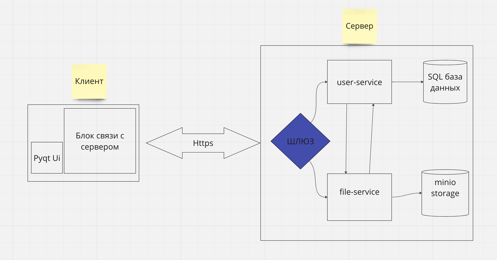

# s21_hahathon

## Описание проекта

Клиент-серверное приложение, обеспечивающее доступ к хранимым данным на удалённом сервере. Приложение позволяет организовать хранение, отображение и управление медиа-контентом. Для достижения этой цели было развёрнуто современное объектное хранилище, которое обеспечивает защиту и конфеденциальность данных, доступ к ним контролируется посредством выдачи ролей и прав для каждого пользователя.



<div style="display: flex; width: 1000px; font-size: 10px; justify-content: center;">Архитектура проекта</div><br>

#### Состав команды:

- twitchfi, spinachc, bullroag, galionme, mordnore

#### Стэк технологий

- Python, Golang, PostgreSQL, grpc, Docker, PyQt, minioS3

## Теоретический функционал

- Для пользовательского интерфейса был использован PyQt (десктопное приложение), отображение иерархии данных происходит в диалоговом окне, там же автоматически формируются миниатюры, видимые при просмотре альбомов. Миниатюры и превью картинок были оптимизированы путём сжатия файла на сервере при получении из объектного хранилища

- Клиентское приложение общается с сервером путём протокола HTTP с использованием архитектуры Rest API. Микросервисы общаются между собой при помощи grpc (Google Remote Procedure Call). Логика на микросервисах была агрегирована таким образом, что отказ одного из модулей позволит пользоваться частью функционала за счёт других модулей

- Для хранения информации о пользователе и сущностях, которыми оперирует приложение, был выбран PostgreSQL. Для хранения файлов был использован minIO - s3 (simple storage service) compatible объектное хранилище. Особенности: легковестность, гибкость в использовании при работе с ненормированными бинарными данными

## Развёртывание микросервисов в Docker

- s3_service:

```
make run
```

Для полноценной работы необходимо установить PostgreSQL на порт 5432 и minio на порт 9000

- gateway:

```
make docker
```

